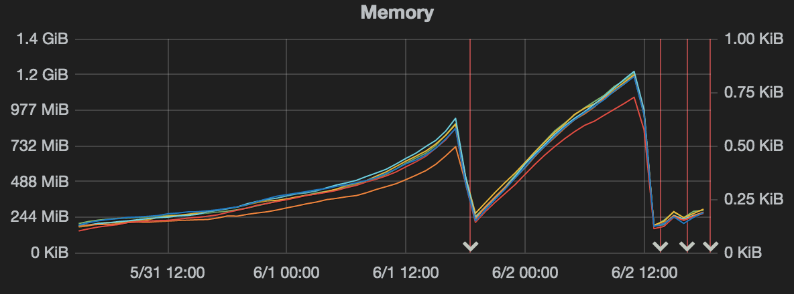
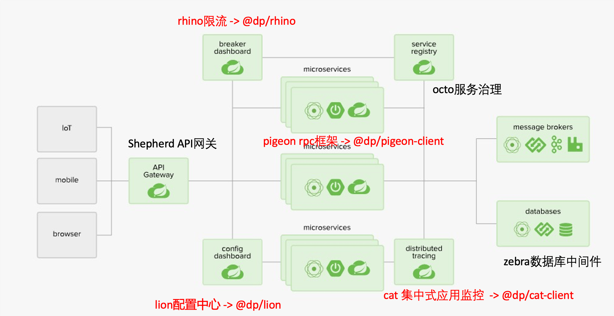
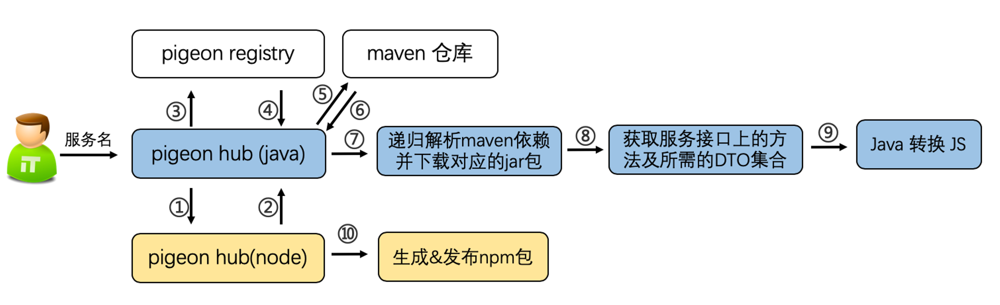
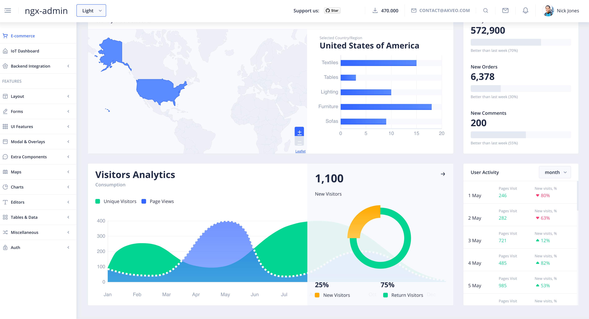
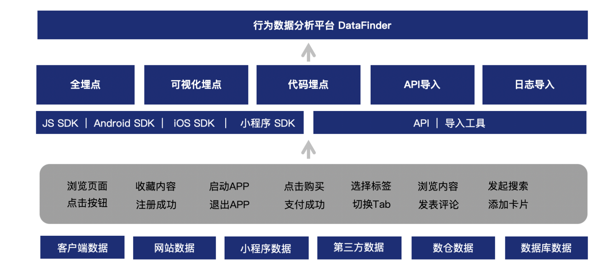

# 前端打怪升级之路

---
### 丁文江 

字节跳动数据平台前端


---
- 学生时代：一把梭
- 第一份工作：正规军
- 工作方向调整：新挑战
- 新工作、新业务

---
## 学生时代：一把梭

--
- wordpress二次开发
- php是世界上最好的语言
- orm是什么？不存在的


---
## 第一份工作：正规军

--

第一个"正儿八经"需求
- 地图sdk对接
- 设计模式
- 依赖注入
- 性能优化


--
炸了


--
第一版的依赖注入实现
```javascript
// 依赖注册
container['map'] = xxx
container['position'] = yyyy


function Biz(map, position) {
    // 业务逻辑
}

```

代码压缩混淆后
```javascript
a['map'] = xxx
b['position'] = yyyy


function B(m, p) {
}

```

--
改进后依赖注入实现
```javascript
// 依赖注册
container['map'] = xxx
container['position'] = yyyy


function Biz(['map', 'position'], map, position) {
    // 业务逻辑
}
```

代码压缩混淆后
```javascript
a['map'] = xxx
b['position'] = yyyy


function B(['map', 'position'], m, p) {
}

```

--
一点感受:
1. 要想程序过得去，总得出点bug
2. 和小伙伴们一起解决线上的问题才能算是真正融入公司、团队
3. 线上出问题不要慌，冷静排查问题，事后总结如何规避才是正确的处理方式

--
- 点评m站、pc站
- 大众点评小程序开发
- hybrid模块、点评app开发


--


--


--
应用开发规范
- 日志打点：页面的曝光、点击有据可依
- 错误监控：可以及时告警，快速解决线上的问题
- 性能监控：业务开发过程中一些性能优化点都可以通过性能监控平台量化

-- 
c端开发的热门话题
- 跨端
- 模块化
- 动态化
- 工程化
- 端智能

---
## 工作方向调整：新挑战
-- 
- 内心喜欢做有挑战的事
- 对node.js有一定的兴趣
- 基本看完了公司在用的node基础组件
- 负责node基础组件的大哥离职了

-- 



--
- node 基础组件维护、迭代
- util-m-xxx 系列前端组件维护、迭代


--
维护的基础组件


--
前端支撑项目：


-- 
总结下：
1. 学习是自己的事情，需要一定的自驱力
2. 随时迎接新挑战的准备
3. 技术上不设边界，兼顾的技术的广度和深度


---
## 新工作、新业务

-- 
我以为的tob业务:


-- 
真实的tob业务



-- 
- 关注产品:  智能推送模块
- 追求极致:  广告追踪模块


---
## Q&A